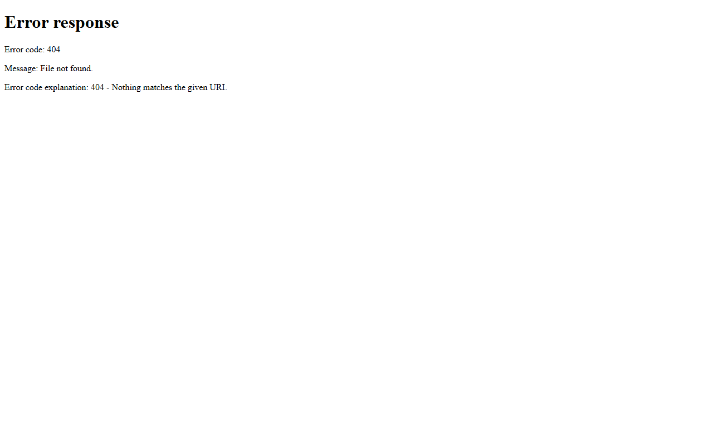

# 🚀 Playwright Website Scraper Pro

**An advanced Playwright-based website scraping and cloning tool with a desktop GUI, Express.js backend, real-time controls, asset downloading, screenshots, and multi-page export functionality.**

Documented · MIT licensed · Maintained

---

## Screenshots

## 🐍 Contribution graph

<picture>
  <source media="(prefers-color-scheme: dark)" srcset="https://raw.githubusercontent.com/mafzalkalwardev/playwright-website-scraper-pro/output/snake-dark.svg" />
  <source media="(prefers-color-scheme: light)" srcset="https://raw.githubusercontent.com/mafzalkalwardev/playwright-website-scraper-pro/output/snake.svg" />
  
</picture>

---

## 🚀 Quick start

Clone the repository and follow project-specific setup in docs.
